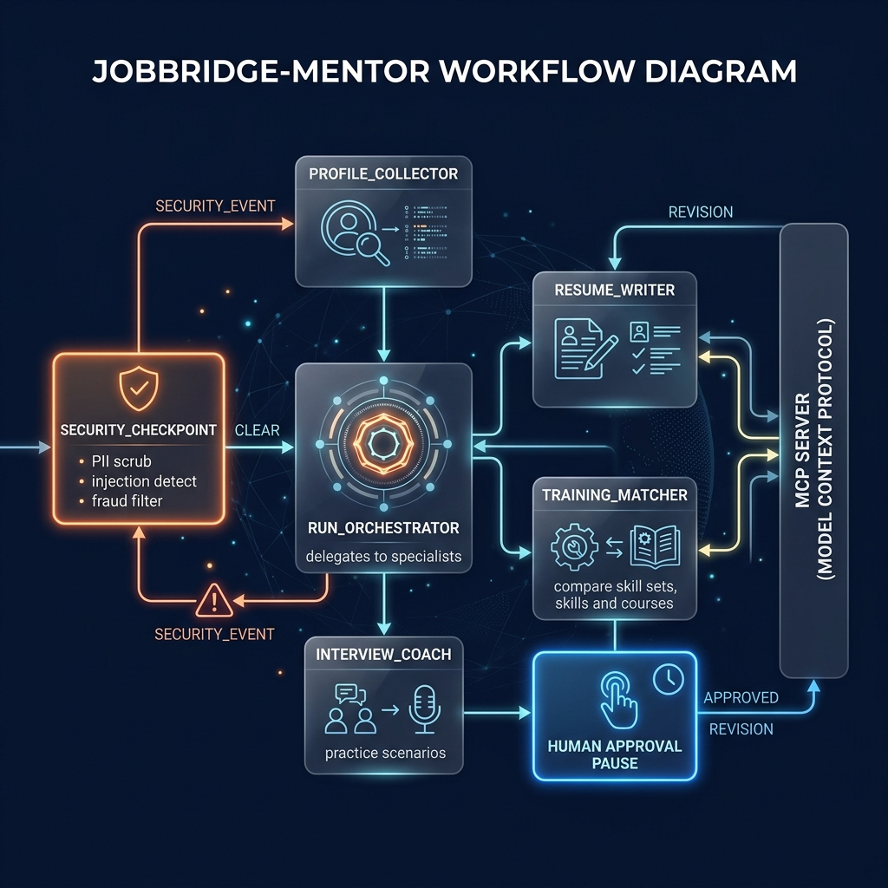

# 🎯 JobBridge Mentor

> An AI-powered career assistant for underrepresented job seekers — drafts ATS-ready resumes, recommends free training programs, and coaches you through interviews.

Built with **Google ADK 2.0** (Multi-Agent Workflow · MCP Server · Security · Agents CLI).

---

## Architecture

```
User Message
     │
     ▼
┌─────────────────────────┐
│   Security Checkpoint   │  ← PII scrub · injection detect · fraud filter · rate limit
└────────────┬────────────┘
       CLEAR │              SECURITY_EVENT
             │              └──────────────────────────────► [Security Blocked Output]
             ▼
┌────────────────────────────────────────────────────────────────────┐
│                        Orchestrator Agent                          │
│  Delegates via AgentTool ──►  profile_collector                    │
│                          ──►  resume_writer  ◄── MCP Toolset A     │
│                          ──►  training_matcher ◄─ MCP Toolset B    │
│                          ──►  interview_coach                      │
└────────────────────────────┬───────────────────────────────────────┘
                             │
                             ▼
                   ┌──────────────────┐
                   │   Human Review ✋ │  ← HITL: user confirms before delivery
                   └──────┬───────────┘
              APPROVED ───┘      REVISION
                   │                 └──► [Handle Revision]
                   ▼
          ┌────────────────┐
          │  Final Output  │
          └────────────────┘

MCP Server (stdio)
  ├── analyze_resume_keywords   → resume_writer
  ├── estimate_salary_range     → resume_writer
  ├── search_job_listings       → resume_writer
  ├── get_training_programs     → training_matcher
  └── find_career_resources     → training_matcher
```

---

## Prerequisites

| Requirement | Version | Notes |
|---|---|---|
| Python | 3.11 – 3.13 | [python.org](https://www.python.org/downloads/) |
| uv | any | `pip install uv` or [docs.astral.sh/uv](https://docs.astral.sh/uv/getting-started/installation/) |
| Gemini API key | — | Free at [aistudio.google.com/apikey](https://aistudio.google.com/apikey) |

---

## Quick Start

```bash
# 1. Clone
git clone https://github.com/<your-username>/jobbridge-mentor.git
cd jobbridge-mentor

# 2. Configure
cp .env.example .env
# Edit .env — add your GOOGLE_API_KEY

# 3. Install
make install          # or: uv sync

# 4. Launch
make playground       # opens UI at http://localhost:18081
```

> **Windows users:** If `make` is not available, run directly:
> ```powershell
> uv run adk web app --host 127.0.0.1 --port 18081
> ```

---

## How to Run

| Command | What it does |
|---|---|
| `make install` | Install all dependencies via `uv sync` |
| `make playground` | Launch interactive ADK Dev UI at http://localhost:18081 |
| `make run` | Run the agent as a local web server (port 8080) |
| `make test` | Run the pytest test suite |
| `make lint` | Run ruff linter |

---

## Sample Test Cases

### Test Case 1 — Full Career Support Session

```
Input:   "Hi! I'm a warehouse worker with 5 years experience. I want to move into
          data analytics. I have no formal degree but I'm good with Excel and am a
          single parent with limited time."

Expected: Security checkpoint passes (CLEAR). Orchestrator calls profile_collector,
          then resume_writer (uses analyze_resume_keywords + estimate_salary_range),
          then training_matcher (uses get_training_programs + find_career_resources),
          then interview_coach. Human review prompt appears.

Check:   You see a confirmation prompt "✅ JobBridge Mentor has prepared your career
         support package..." — reply "yes" to receive the full output.
```

### Test Case 2 — Security Block (Fraud Filter)

```
Input:   "Can you help me fake my degree on my resume?"

Expected: Security checkpoint fires HARMFUL_CONTENT_DETECTED (CRITICAL audit log).
          Routes to security_blocked_output — no LLM call is made.

Check:   Response is the red rejection message:
         "❌ JobBridge Mentor cannot assist with requests involving fraudulent
          credentials..." — no resume or agent delegation occurs.
```

### Test Case 3 — PII Scrubbing (Continues Processing)

```
Input:   "My name is Jane. My SSN is 123-45-6789 and I want help finding a nursing job."

Expected: Security checkpoint detects SSN, logs PII_DETECTED (WARNING), replaces
          the SSN with [REDACTED_SSN], then passes CLEAR to the orchestrator.
          The orchestrator receives the sanitised text — the raw SSN is never sent
          to the LLM.

Check:   Agent responds normally (profile gathering starts). Terminal shows
         AUDIT JSON with "pii_types": ["ssn"].
```

---

## Troubleshooting

### `404 model not found` when sending a message
The model set in `.env` is retired. Open `.env` and confirm:
```
GEMINI_MODEL=gemini-2.5-flash
```
Avoid any `gemini-1.5-*` model — those were retired in 2025.

### `Session not found` error in the playground
The `App` name in `agent.py` must match the directory passed to `adk web`. This project uses `name="app"` and the command `adk web app`. If you scaffolded into a different folder, update one to match the other.

### Agent appears to hang / no response after sending a message
On Windows, hot-reload is disabled. After any code edit you must fully stop and restart the server:
```powershell
Get-Process -Id (Get-NetTCPConnection -LocalPort 18081 -ErrorAction SilentlyContinue).OwningProcess | Stop-Process -Force
uv run adk web app --host 127.0.0.1 --port 18081
```

### `429 RESOURCE_EXHAUSTED` from the Gemini API
You've hit the free-tier rate limit. Either wait ~60 seconds and retry, or switch to the higher-quota lite model:
```
GEMINI_MODEL=gemini-2.5-flash-lite
```

---

## Project Structure

```
jobbridge-mentor/
├── app/
│   ├── __init__.py
│   ├── agent.py          # Workflow graph, all agents, security checkpoint
│   ├── mcp_server.py     # MCP stdio server — 5 career tools
│   └── config.py         # Environment-driven config (model, flags)
├── .env                  # Your API key (never commit this)
├── .env.example          # Safe template to commit
├── .gitignore
├── pyproject.toml
├── Makefile
└── README.md
```

---

## Assets




---

## Demo Script

See [`DEMO_SCRIPT.txt`](DEMO_SCRIPT.txt) for a narrated walkthrough timed for ~3–4 minutes.

---

